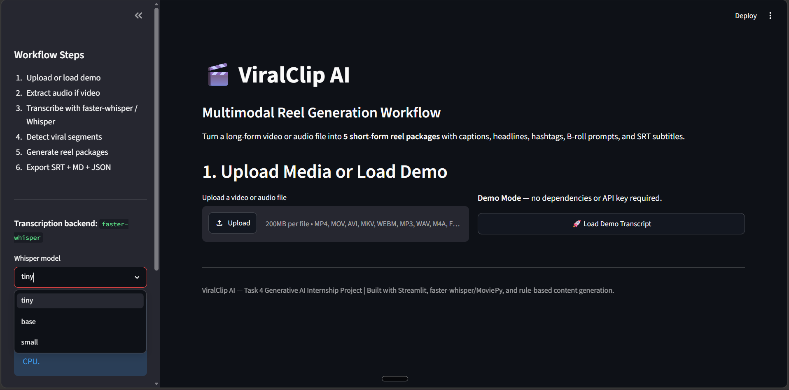

# ViralClip AI

> **Transform long-form videos into viral short-form content — automatically.**

ViralClip AI is a production-ready Python application that analyzes videos, identifies the most shareable moments, and generates complete reel packages with captions, headlines, B-roll prompts, and subtitles — ready for TikTok, Instagram Reels, and YouTube Shorts.


---

## Table of Contents

- [Overview](#overview)
- [Key Features](#key-features)
- [Quick Start](#quick-start)
- [Architecture](#architecture)
- [Project Structure](#project-structure)
- [Usage Examples](#usage-examples)
- [Screenshots](#screenshots)
- [Installation Guide](#installation-guide)
- [Configuration](#configuration)
- [Features in Detail](#features-in-detail)
- [Runway Integration](#runway-integration)
- [Performance Benchmarks](#performance-benchmarks)
- [Tech Stack](#tech-stack)
- [Limitations](#limitations)
- [Roadmap](#roadmap)
- [Contributing](#contributing)
- [FAQ](#faq)
- [License](#license)
- [Author](#author)

---

## Overview

### The Problem

Content creators spend hours identifying viral moments in long-form videos:

- Manually scrubbing through timelines
- Writing captions and headlines from scratch
- Guessing which clips will perform well
- Creating subtitles and B-roll planning documents

### The Solution

ViralClip AI automates the entire workflow through a modular, end-to-end pipeline:

1. **Extracts** audio from video files (MP4, MOV, WebM, and more)
2. **Transcribes** with Whisper / faster-whisper, generating timestamped segments
3. **Analyzes** content across 7 viral criteria — hook strength, emotional intensity, educational value, clarity, shareability, quote-worthiness, and short-form suitability
4. **Selects** the top 5 highest-scoring segments
5. **Generates** complete reel packages: hooks, headlines, captions, hashtags, B-roll descriptions, and Runway-ready prompts
6. **Exports** everything as Markdown, JSON, and SRT subtitle files

All delivered through a clean Streamlit dashboard — **no API keys required**.

---

## Key Features

| Feature | Description |
|---|---|
| ⚡ **One-Click Processing** | Upload a video, get 5 complete reel packages in minutes |
| 🧠 **Smart Segment Detection** | 7-dimensional heuristic scoring identifies viral moments |
| 📦 **Complete Content Packages** | Hooks, headlines, captions, hashtags, and B-roll per reel |
| 🎬 **Runway Integration** | AI-ready B-roll prompts formatted for Runway ML |
| 📝 **SRT Subtitle Generation** | Synchronized captions distributed across all 5 reel segments |
| 🖥️ **Demo Mode** | Works fully offline — no Whisper or FFmpeg required |
| 📁 **Structured Exports** | Markdown, JSON, and SRT formats out of the box |
| ✅ **Production Ready** | Clean architecture, full documentation, zero external API dependencies |

---

## Quick Start

### Installation

```bash
# Clone the repository
git clone https://github.com/kvsajith34/ViralClip-AI.git
cd ViralClip-AI

# Create and activate a virtual environment
python -m venv venv
source venv/bin/activate        # macOS / Linux
# venv\Scripts\activate         # Windows

# Install dependencies
pip install -r requirements.txt
```

### Run the App

```bash
streamlit run app.py
```

The dashboard opens at `http://localhost:8501`.

---

### Two Ways to Get Started

**Option A — Demo Mode (No Dependencies)**

1. Click **Load Demo Transcript** in the sidebar
2. Instantly see 5 viral reels generated from a sample transcript
3. Explore the full workflow without installing Whisper or FFmpeg

**Option B — Upload Your Own Video**

1. Select a video file (MP4, MOV, WebM, MP3, WAV, etc.)
2. Choose a Whisper model size (`tiny` for speed, `base` / `small` for accuracy)
3. Click **Process Uploaded File**
4. Review the transcript, viral segments, and generated reel packages
5. Download all exports

---

## Architecture

```
Input Video / Audio
        │
        ▼
Audio Extraction (MoviePy / FFmpeg)
        │
        ▼
Transcription (Whisper / faster-whisper)
        │
        ▼
Timestamped Transcript Segments
        │
        ▼
Viral Scoring Engine  ──  7-Dimensional Analysis
        │
        ▼
Top 5 Segments Selected
        │
        ▼
Content Generation Pipeline
   ├── Hook Lines
   ├── Viral Headlines
   ├── Social Media Captions
   ├── Hashtags
   ├── B-roll Descriptions
   ├── Runway-Ready Prompts
   └── On-Screen Text
        │
        ▼
SRT Subtitle Generation
        │
        ▼
Export  ──  Markdown · JSON · SRT
```

### Viral Scoring Dimensions

Each segment is scored 0–10 across seven independent dimensions:

| Dimension | What It Detects |
|---|---|
| **Hook Strength** | Opening lines, curiosity triggers, pattern breaks |
| **Emotional Intensity** | Emotional language, punctuation emphasis |
| **Educational Value** | Step-by-step processes, instructional language |
| **Clarity** | Optimal length, simple structure, ease of understanding |
| **Shareability** | Quote-worthy phrasing, standalone value |
| **Quote-Worthiness** | Crisp statements, memorable conclusions |
| **Short-Form Suitability** | Compact information density, platform fit |

> **Composite Viral Score** = Weighted average across all seven dimensions.

---

## Project Structure

```
# Project Structure

```bash

Task4-ViralClip-AI-Multimodal-Content-Engine/
├── .env.example                 # Example environment variables
├── .gitignore                   # Git ignore rules
├── app.py                       # Main Streamlit application
├── README.md                    # Project documentation
├── requirements.txt             # Python dependencies
│
├── docs/                        # Project documentation & reports
│   ├── final_reflection.md
│   ├── limitations.md
│   ├── runway_workflow.md
│   ├── task_requirement_mapping.md
│   ├── testing_report.md
│   └── workflow_explanation.md
│
├── landing/                     # React/Vite landing page
│   ├── index.html
│   ├── package.json
│   ├── tsconfig.json
│   ├── vite.config.ts
│   └── src/
│       ├── App.tsx
│       ├── main.tsx
│       ├── index.css
│       └── utils/
│           └── cn.ts
│
├── outputs/                     # Generated content and assets
│   ├── broll_descriptions.md
│   ├── captions_and_hashtags.md
│   ├── full_transcript.json
│   ├── full_transcript.md
│   ├── reel_packages.json
│   ├── reel_packages.md
│   ├── runway_broll_prompts.md
│   ├── viral_segments.json
│   ├── viral_segments.md
│   └── subtitles/
│       ├── reel_1.srt
│       ├── reel_2.srt
│       ├── reel_3.srt
│       ├── reel_4.srt
│       └── reel_5.srt
│
├── prompts/                     # AI prompting templates
│   ├── broll_prompt.md
│   ├── captions_prompt.md
│   ├── headlines_prompt.md
│   ├── runway_prompting_guide.md
│   ├── system_prompt.md
│   └── viral_segment_prompt.md
│
├── sample_media/                # Sample files for testing
│   ├── demo_transcript.md
│   ├── Sample_video.mp4
│   ├── sample_video_link.md
│   └── sample_video_notes.md
│
├── screenshots/                 # Visual documentation
│   ├── app_home.png
│   └── Video_Ref.mp4
│
└── src/                         # Core Python processing modules
    ├── audio_extractor.py
    ├── content_generator.py
    ├── export_utils.py
    ├── segment_selector.py
    ├── srt_generator.py
    ├── transcriber.py
    ├── utils.py
    └── __init__.py

```

---

## Usage Examples

### Demo Mode

```bash
streamlit run app.py

# In the browser:
# 1. Click "Load Demo Transcript" in the sidebar
# 2. 5 reel packages generate in ~5 seconds
# 3. Review outputs directly in the browser
# 4. Download exports from the outputs/ folder
```

### Process Your Own Video

```bash
streamlit run app.py

# In the browser:
# 1. Upload a video or audio file (MP4, MOV, WebM, MP3, WAV, etc.)
# 2. Select a Whisper model: "tiny" (fast) or "base" (accurate)
# 3. Click "Process Uploaded File"
# 4. The app extracts audio, transcribes, scores, and generates reel packages
# 5. Review hooks, captions, hashtags, and B-roll prompts per reel
# 6. All outputs are auto-saved to outputs/
```

### Sample Output (JSON)

```json
{
  "reel_number": 1,
  "start_time": "00:01:51",
  "end_time": "00:03:00",
  "viral_score": 9.2,
  "hook_line": "I spent 6 hours on a reel that got 400 views. Then I changed everything.",
  "viral_headline": "How I Create 30 Reels in 2 Hours With AI",
  "social_media_caption": "How I Create 30 Reels in 2 Hours With AI\n\nI spent 6 hours on a reel that got 400 views. Then I changed everything.\n\nWhat part of your workflow needs the most help? Drop a comment.",
  "hashtags": ["#AICreator", "#ContentCreation", "#ShortFormContent"],
  "suggested_broll_description": "Close-up of a frustrated creator staring at a complex editing timeline on a large monitor. Dim room, blue glow from screen.",
  "runway_ready_broll_prompt": "Cinematic 5-second B-roll clip. Close-up of a frustrated creator staring at a complex editing timeline on a large monitor. Dim room, blue glow from the screen. Smooth camera motion, shallow depth of field, professional color grading, soft ambient lighting, 4K, highly detailed, editorial style.",
  "suggested_on_screen_text": "30 reels in 2 hours",
  "transcript_excerpt": "The breaking point came when I spent six hours editing a reel that got 400 views..."
}
```

---

## Screenshots

### Dashboard Home

*Clean, intuitive interface with sidebar controls and one-click demo mode.*

### Processing Workflow

*Real-time transcript preview and processing status.*

### Viral Segment Analysis

*Automated scoring across all 7 viral dimensions.*

### Reel Package Generation

*Complete content packages with hooks, captions, and metadata.*

### Runway-Ready B-roll Prompts

*AI prompts optimized for Runway ML Text-to-Video generation.*

---

## Installation Guide

### Prerequisites

| Requirement | Version | Notes |
|---|---|---|
| Python | 3.10+ | Required |
| FFmpeg | Any | Optional — bundled via `imageio-ffmpeg` |

### Platform Setup

```bash
# Windows
python -m venv venv
venv\Scripts\activate
pip install --upgrade pip setuptools wheel
pip install -r requirements.txt
streamlit run app.py

# macOS / Linux
python3 -m venv venv
source venv/bin/activate
pip install --upgrade pip setuptools wheel
pip install -r requirements.txt
streamlit run app.py
```

### Optional: Install FFmpeg System-Wide

Only needed if `imageio-ffmpeg` encounters issues on your platform.

```bash
# Windows
winget install Gyan.FFmpeg

# macOS
brew install ffmpeg

# Linux
sudo apt-get install ffmpeg
```

---

## Configuration

### Environment Variables

Create a `.env` file to enable optional LLM-assisted generation:

```env
# Optional: OpenAI
OPENAI_API_KEY=sk-your-key-here
OPENAI_MODEL=gpt-4o-mini

# Optional: Anthropic Claude
ANTHROPIC_API_KEY=sk-ant-your-key-here
```

> **Note:** The app runs fully offline using rule-based generation. LLM integration is entirely optional and does not affect core functionality.

---

## Features in Detail

### Audio Extraction

- **Supported formats:** MP4, MOV, WebM, AVI, MKV, MP3, WAV, M4A, FLAC, AAC, OGG
- **Fallback chain:** FFmpeg → MoviePy → Audio passthrough
- **Output:** 16 kHz mono PCM WAV — optimized for Whisper
- **Windows-friendly:** Uses `imageio-ffmpeg`; no manual PATH configuration needed

### Transcription

- **Primary engine:** faster-whisper (lower latency, reduced memory usage)
- **Fallback engine:** OpenAI Whisper (higher accuracy)
- **Demo mode:** Built-in sample transcript for offline testing
- **Available models:** `tiny`, `base`, `small`

### Heuristic Viral Scoring

Powered by 50+ viral keywords and emotional markers to detect:

- Strong hook openings and curiosity triggers
- Emotional language and urgency signals
- Process-oriented, instructional phrasing
- Concise, memorable, quote-worthy statements

### Content Generation (Rule-Based)

| Output | Method |
|---|---|
| **Hooks** | Pattern matching + template filling |
| **Headlines** | Segment themes → benefit-driven phrasing |
| **Captions** | Multi-line social copy with engagement prompts |
| **Hashtags** | Contextual tags derived from segment content |
| **B-roll** | Scene descriptions tuned for video generation |
| **Runway Prompts** | Camera-motion-aware cinematic descriptions |

### Structured Export

**File formats:**

- `Markdown` — Human-readable, editor-friendly
- `JSON` — Machine-readable, spreadsheet-compatible
- `SRT` — Video subtitle files (5 files, one per reel)

**Output files generated:**

| File | Contents |
|---|---|
| `full_transcript.md / .json` | Complete timestamped transcript |
| `viral_segments.md / .json` | Top 5 segments with composite scores |
| `reel_packages.md / .json` | Full reel content and metadata per segment |
| `captions_and_hashtags.md` | Ready-to-post social media copy |
| `broll_descriptions.md` | Visual scene suggestions per reel |
| `runway_broll_prompts.md` | Ready-to-paste Runway ML prompts |
| `subtitles/reel_1–5.srt` | Synchronized subtitle files |

---

## Runway Integration

ViralClip AI generates B-roll prompts optimized for Runway ML's Text-to-Video:

```
Cinematic 5-second B-roll clip. Close-up of a frustrated creator staring
at a complex editing timeline on a large monitor. Dim room, blue glow from
the screen. Smooth camera motion, shallow depth of field, professional
color grading, soft ambient lighting, 4K, highly detailed, editorial style.
```

**Workflow:**

1. Run ViralClip AI → generate reel packages
2. Open `outputs/runway_broll_prompts.md`
3. Copy a prompt → paste into Runway's Text-to-Video tool
4. Generate a 5-second B-roll clip
5. Download and sync with your video editor

See [`docs/runway_workflow.md`](docs/runway_workflow.md) for step-by-step instructions.

---

## Performance Benchmarks

| Task | Hardware | Time |
|---|---|---|
| Demo Transcript Processing | Any | ~5 sec |
| 10-min MP4 Transcription | CPU (Whisper `tiny`) | 2–3 min |
| 10-min MP4 Transcription | CPU (Whisper `base`) | 5–7 min |
| Viral Scoring + Content Generation | Any | ~10 sec |
| Full End-to-End (10-min video) | CPU | ~7–10 min |

> **Tip:** Use the `tiny` model for rapid iteration during development; switch to `base` or `small` for production-quality output.

---

## Tech Stack

| Component | Technology |
|---|---|
| **Frontend / Dashboard** | Streamlit 1.30+ |
| **Language** | Python 3.10+ |
| **Audio Extraction** | MoviePy · FFmpeg · imageio-ffmpeg |
| **Transcription** | Whisper · faster-whisper |
| **Exports** | Markdown · JSON · SRT |
| **Utilities** | python-dotenv · datetime · re · json |

> **Zero external API calls** — the entire pipeline runs locally on your machine.

---

## Limitations

| # | Limitation | Notes |
|---|---|---|
| 1 | **Whisper Accuracy** | Performance depends on audio quality, accent, and background noise |
| 2 | **Heuristic Scoring** | Keyword-based; may not generalize to all content styles |
| 3 | **Timestamps** | Auto-generated; manual review recommended before final editing |
| 4 | **B-roll Generation** | Prompts only — actual video generation happens externally via Runway |
| 5 | **Content Review** | All captions, headlines, and hashtags should be reviewed before publishing |
| 6 | **Copyright** | Only process videos you own or have explicit rights to use |

See [`docs/limitations.md`](docs/limitations.md) for full details and workarounds.

---

## Roadmap

- [ ] Fine-tune scoring with real engagement metrics
- [ ] Speaker diarization for multi-person podcasts
- [ ] Runway API integration (when stable)
- [ ] Custom user-trained scoring models per niche
- [ ] Multi-language transcription and content support
- [ ] Batch processing API
- [ ] Cloud deployment templates (Docker, AWS, Heroku)

---

## Contributing

Contributions are welcome. Areas currently open for enhancement:

- Speaker diarization for multi-person podcasts
- Fine-tuned viral scoring using real engagement data
- Direct Runway API integration
- LLM-powered caption generation (Claude / GPT)
- Trending audio analysis via TikTok / Reels scrapers
- Custom scoring models per niche (educational, comedy, self-help)

**To contribute:**

```bash
# 1. Fork the repository
# 2. Create a feature branch
git checkout -b feature/your-feature-name

# 3. Commit your changes
git commit -m "feat: describe your change"

# 4. Push and open a pull request
git push origin feature/your-feature-name
```

---

## FAQ

**Do I need API keys to use this?**  
No. The app runs fully offline with rule-based generation. LLM integration is optional and adds no required dependencies.

**What's the minimum recommended video length?**  
30 seconds or longer. Shorter videos may yield fewer viable segment candidates.

**Can I use this with copyrighted content?**  
Only with permission from the copyright holder. Personal fair use may apply depending on your jurisdiction.

**How accurate is the viral scoring?**  
It's heuristic-based. It reliably identifies common viral patterns — hooks, emotional language, instructional phrasing — but cannot fully replace human editorial judgment.

**Do I need FFmpeg installed separately?**  
No. `imageio-ffmpeg` is bundled and handles most use cases. The system FFmpeg is used only as a fallback.

**Can I deploy this to the cloud?**  
Yes. See [`docs/deployment.md`](docs/deployment.md) for Docker, AWS, and Heroku deployment guides.

---

## License

This project is licensed under the **MIT License** — free for personal and commercial use.  
See [`LICENSE`](LICENSE) for full terms.

---

## Support

- **Bug reports:** Open a [GitHub Issue](https://github.com/kvsajith34/ViralClip-AI/issues) with your video details and the full error message
- **Questions:** Use the [GitHub Discussions](https://github.com/kvsajith34/ViralClip-AI/discussions) tab
- **Documentation:** Refer to the [`docs/`](docs/) folder and inline code comments
- **Quick start:** Click **Load Demo Transcript** — no dependencies required

---

## Acknowledgements

Built with open-source tools:

- [Streamlit](https://streamlit.io/) — Fast web apps in pure Python
- [Whisper](https://github.com/openai/whisper) — Robust open-source speech recognition by OpenAI
- [faster-whisper](https://github.com/SYSTRAN/faster-whisper) — Optimized Whisper inference by SYSTRAN
- [MoviePy](https://github.com/Zulko/moviepy) — Video editing library for Python
- [FFmpeg](https://ffmpeg.org/) — Cross-platform multimedia framework

---

## Author

**Venkata Sai Ajith Kancheti**  
[GitHub](https://github.com/kvsajith34) 

---

<p align="center">Made for creators who work smarter, not harder.</p>

## Multimodal Workflow Diagram

```
┌─────────────────┐
│  Upload Video   │
│  or Audio File  │
└────────┬────────┘
         │
         ▼
┌─────────────────┐
│ Audio Extraction│
│ (MoviePy/FFmpeg)│
└────────┬────────┘
         │
         ▼
┌─────────────────┐
│ Transcription   │
│ (Whisper)       │
└────────┬────────┘
         │
         ▼
┌─────────────────┐
│ Timestamped     │
│ Transcript      │
└────────┬────────┘
         │
         ▼
┌─────────────────┐
│ Viral Segment   │
│ Scoring         │
└────────┬────────┘
         │
         ▼
┌─────────────────┐
│ Top 5 Segments  │
└────────┬────────┘
         │
         ▼
┌─────────────────┐
│ Content Gen     │
│ Captions/Heads  │
└────────┬────────┘
         │
         ▼
┌─────────────────┐
│ B-roll Prompts  │
│ Runway-ready    │
└────────┬────────┘
         │
         ▼
┌─────────────────┐
│ SRT Export +    │
│ MD/JSON Outputs │
└─────────────────┘
```